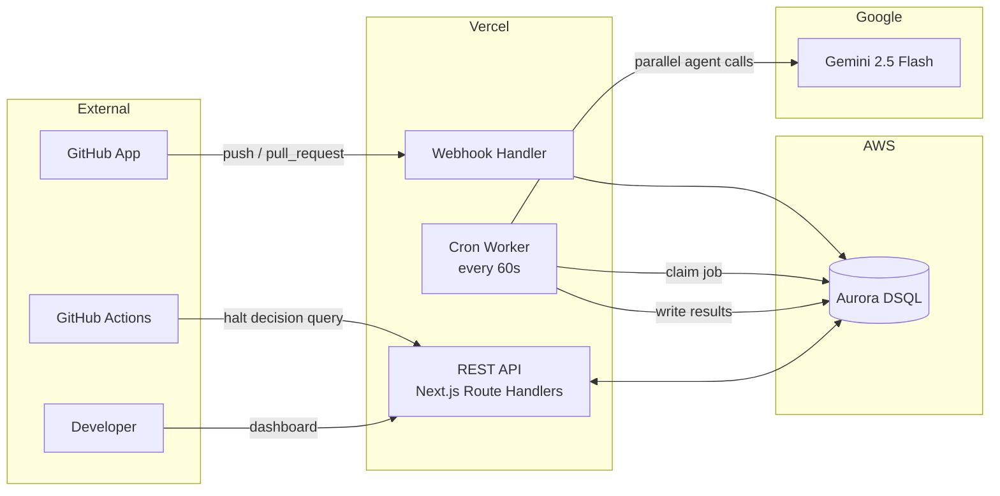
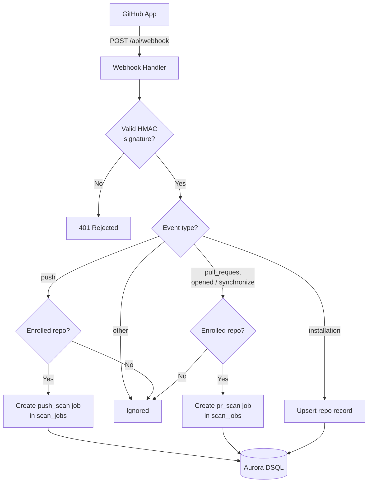
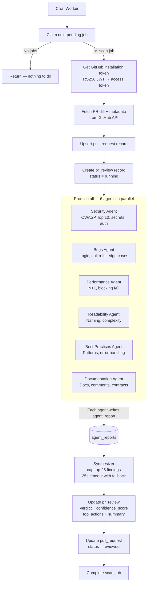
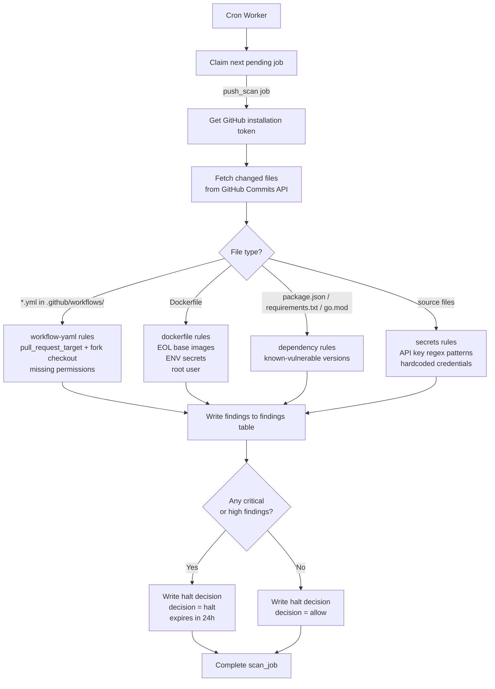
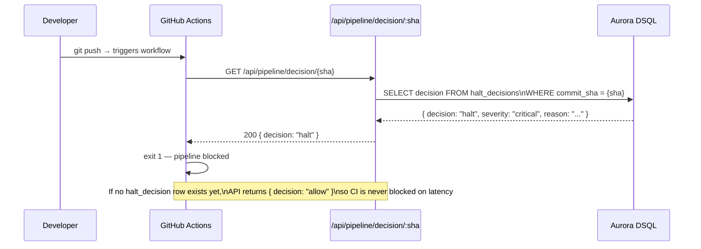
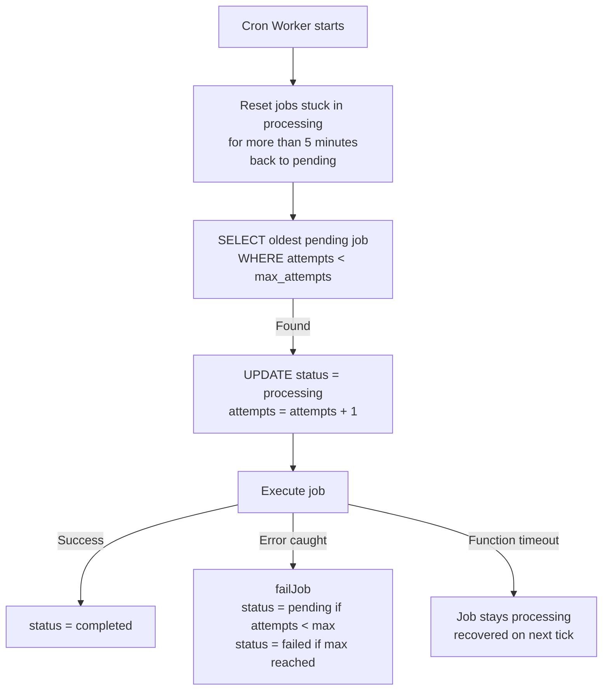
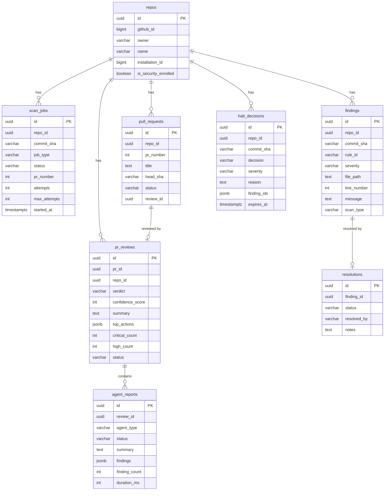
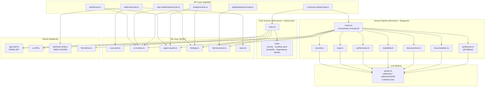

# Gatecheck — Architecture

This document covers the system design, data flows, and component relationships for Gatecheck.

---

## Contents

1. [System Overview](#1-system-overview)
2. [Webhook Ingestion](#2-webhook-ingestion)
3. [PR Review Pipeline](#3-pr-review-pipeline)
4. [Push Scan Pipeline](#4-push-scan-pipeline)
5. [CI Halt Gate](#5-ci-halt-gate)
6. [Stale Job Recovery](#6-stale-job-recovery)
7. [Database Schema](#7-database-schema)
8. [Component Map](#8-component-map)

---

## 1. System Overview

Gatecheck is a fully serverless application. There is no long-running server, no message broker, and no separate worker process. Aurora DSQL acts as both the relational store and the job queue. Vercel Cron fires a lightweight worker function every minute that claims the next pending job and executes it.



**Why Aurora DSQL as a job queue?**

Aurora DSQL is serverless and PostgreSQL-compatible, which means it can be used for both structured data queries and optimistic-locking job claiming without a separate broker. Vercel Cron invokes the worker once per minute; the worker claims up to 5 jobs per invocation with a two-step SELECT + UPDATE to avoid double-processing.

---

## 2. Webhook Ingestion

Every push and pull request event from an enrolled repository is received at `POST /api/webhook`. The handler verifies the HMAC-SHA256 signature, routes the event by type, and enqueues a scan job.



**Key constraints applied here:**

- Repos that are not marked `is_security_enrolled = true` are silently skipped — no job created
- Job records store `repo_id`, `commit_sha`, `pr_number`, and `job_type`; the actual diff is fetched at execution time to avoid storing large payloads in the queue
- Each job starts with `status = 'pending'` and `attempts = 0`; `max_attempts = 3`

---

## 3. PR Review Pipeline

When the cron worker claims a `pr_scan` job, it runs the full 6-agent review pipeline and writes results back to Aurora DSQL.



**Agent implementation:**

Each of the six agents calls `callGeminiJSON()` with the PR diff and a domain-specific system prompt. The response schema is:

```ts
{
  summary: string                  // 2–3 sentence overview
  findings: Array<{
    severity: 'critical' | 'high' | 'medium' | 'low' | 'info'
    category: string               // short label e.g. "SQL Injection"
    message: string                // clear description
    file: string                   // path in the repo
    line: number                   // line number in the diff
    suggestion: string             // how to fix it
  }>
}
```

**Synthesizer design:**

The synthesizer receives all agent outputs and:
1. Caps the findings list (top 8 critical/high + top 5 medium) to keep the prompt small
2. Truncates each agent summary to 120 characters
3. Races Gemini against a 25-second timeout
4. Falls back to a code-generated verdict if Gemini doesn't respond in time — the verdict, confidence score, and top actions are computed directly from the finding severity counts so the review always completes

---

## 4. Push Scan Pipeline

When the cron worker claims a `push_scan` job, it runs the deterministic rule engine against files fetched from the GitHub API.



**Rule engine:**

Rules live in `lib/security/rules/` and implement a common interface:

```ts
interface SecurityRule {
  id: string
  severity: 'critical' | 'high' | 'medium' | 'low'
  check(file: string, content: string): Finding[]
}
```

Findings are immutable — they are appended only, never updated. Resolution state (fixed, muted, false-positive) is tracked in a separate `resolutions` table.

---

## 5. CI Halt Gate

The halt gate is a two-component design: a decision writer (part of the push scan) and a decision reader (queried by the CI step).



**Timing guarantee:** The push scan job is enqueued immediately on webhook receipt. The cron worker fires within 60 seconds. Most pushes are scanned before a typical CI workflow reaches the gate step. If not, the API returns `allow` and the scan result is surfaced on the dashboard without blocking.

---

## 6. Stale Job Recovery

Vercel serverless functions have a maximum execution time. If the function is killed mid-review, the job stays in `status = 'processing'` indefinitely. The cron worker handles this with a recovery step at the start of every invocation.



**The stale threshold is 5 minutes**, passed as a timestamp parameter to avoid DSQL INTERVAL compatibility issues.

**Retry behaviour:** On failure, the error message is stored in `scan_jobs.error` and the job resets to `pending` until `max_attempts` (3) is exhausted, at which point it moves to `failed` permanently.

---

## 7. Database Schema



**Aurora DSQL constraints applied throughout:**

- No foreign key constraints — referential integrity enforced at the application layer
- No `ON CONFLICT` unless backed by an inline `UNIQUE` constraint (async indexes cannot be conflict targets)
- All indexes created with `CREATE INDEX ASYNC`
- No `SELECT ... FOR UPDATE` or `SKIP LOCKED` — job claiming uses optimistic SELECT + conditional UPDATE

---

## 8. Component Map


