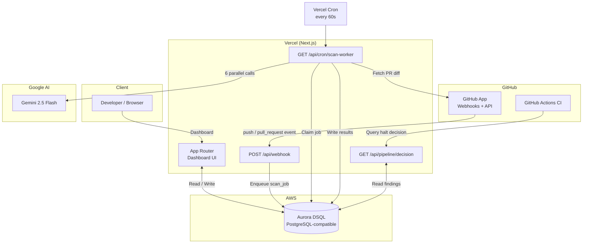

<div align="center">
  <h1>Gatecheck</h1>
  <strong>AI-powered security gate for every pull request and CI pipeline.</strong>
</div>

<p align="center">
  
  
  
  
  
  
</p>

---

## Overview

Gatecheck is a CI security scanner that runs six Gemini AI agents in parallel on every pull request, detecting vulnerabilities across security, bugs, performance, readability, best practices, and documentation. A synthesizer agent combines all findings into a single verdict with a confidence score and prioritised action list.

Beyond PR reviews, Gatecheck also scans pushes to enrolled branches for hardcoded secrets, insecure Docker configurations, supply-chain attack patterns in GitHub Actions workflows, and vulnerable dependencies — then writes a halt decision that a lightweight CI step can query to block the deployment before anything ships.

## Hackathon Submission

Built for the **Vercel × AWS Hackathon**.

**Live Demo:** https://gatecheck-theta.vercel.app

**Key Innovation:** A serverless, queue-free AI review pipeline built entirely on Aurora DSQL as both the relational data store and the job queue — no Redis, no BullMQ, no separate worker process.

---

## The Problem

Most teams rely on manual code review to catch security vulnerabilities, but human reviewers are inconsistent, expensive for every PR, and miss entire vulnerability classes: supply-chain attacks, JWT algorithm confusion, command injection patterns. By the time a static scan runs in CI, the bad code is already merged.

## Solution

Gatecheck intercepts pull requests and pushes via a GitHub App webhook — before a single line reaches production:

- **6 specialist AI agents** review every PR simultaneously — no waiting for sequential analysis
- **Deterministic security rules** scan CI workflow YAML, Dockerfiles, and dependency files on every push
- **Halt decisions** are written to Aurora DSQL and queried by a GitHub Actions step that blocks the pipeline if critical findings exist
- **Repo Health score** tracks your codebase's security posture over time with trend charts and signal cards

---

## High-Level System Architecture



---

## Key Features

### Multi-Agent PR Review

Six Gemini 2.5 Flash agents run in parallel on every pull request diff:

| Agent | Focus area |
|---|---|
| Security | OWASP Top 10, injection, auth bypass, exposed secrets |
| Bugs | Logic errors, null dereferences, edge-case failures |
| Performance | N+1 queries, blocking I/O, unnecessary allocations |
| Readability | Naming, complexity, dead code |
| Best Practices | Design patterns, error handling, test coverage signals |
| Documentation | Missing docs, stale comments, API contract gaps |

A synthesizer then combines all findings into a single verdict (`approve` / `request_changes` / `comment`) with a confidence score and the top three concrete actions your team needs to take.

### CI Security Gate

A deterministic rule engine scans files on every push without running your code:

- **Secrets** — regex patterns for API keys, tokens, and private keys embedded in source
- **Workflow YAML** — `pull_request_target` + fork checkout (supply-chain RCE), missing permissions scoping
- **Dockerfile** — EOL base images, secrets baked into `ENV` layers, running as root
- **Dependencies** — known-vulnerable package versions across `package.json`, `requirements.txt`, `go.mod`

A halt decision is written to Aurora DSQL and queried by your CI step at `/api/pipeline/decision/:sha`. Critical findings block the pipeline before any deployment step runs.

### Repo Health Score

A 0–100 score computed on-demand from three weighted signals:

| Signal | Weight | Source |
|---|---|---|
| Findings Debt | 40% | Weighted open findings by severity (`critical×10 + high×5 + medium×2 + low×1`) |
| AI Confidence | 30% | Average confidence score across the last 30 completed reviews |
| Scan Coverage | 30% | Completed scans relative to a 10-scan baseline |

Score ≥ 80 = Healthy · 60–79 = Needs Attention · < 60 = At Risk

### Real-time Dashboard

The PR detail page polls every 5 seconds while a review runs — each agent tab updates live with its finding count as it completes, before the synthesizer verdict appears.

---

## Getting Started

### 1. Install the GitHub App

Install the [Gatecheck GitHub App](https://github.com/apps/gate-check) on your repositories. Webhooks are configured automatically — no YAML to write.

### 2. Enroll a Repository

Go to **Repositories** in the dashboard and click **Enroll** on any repo where the GitHub App is installed. This enables both PR review and push scanning for that repo.

### 3. Trigger Your First Review

**PR Review:** Open or update a pull request on an enrolled repo. Gatecheck picks up the webhook and starts the 6-agent review within seconds.

**CI Scan:** Push a commit touching `.github/workflows/`, a `Dockerfile`, or a dependency manifest. Gatecheck scans it and surfaces findings on the dashboard.

### 4. Add the CI Gate (Optional)

```yaml
- name: Gatecheck security gate
  run: |
    DECISION=$(curl -sf \
      "https://gatecheck-theta.vercel.app/api/pipeline/decision/${{ github.sha }}" \
      -H "Authorization: Bearer ${{ secrets.GATECHECK_TOKEN }}" \
      | jq -r '.decision')
    if [ "$DECISION" = "halt" ]; then
      echo "Gatecheck: critical findings block this deployment"
      exit 1
    fi
```

---

## Tech Stack

| Layer | Technology |
|---|---|
| Framework | Next.js 16 App Router (TypeScript) |
| Hosting | Vercel (serverless functions + cron) |
| Database | AWS Aurora DSQL (serverless PostgreSQL-compatible) |
| AI | Google Gemini 2.5 Flash via `@google/generative-ai` |
| GitHub Integration | GitHub App (RS256 JWT → installation token) |
| Charts | Recharts |
| Styling | Tailwind CSS 4 + custom claymorphism design system |

---

## Environment Variables

```env
# GitHub App
GITHUB_APP_ID=your_app_id
GITHUB_APP_PRIVATE_KEY=base64_encoded_pem
GITHUB_WEBHOOK_SECRET=your_webhook_secret

# AWS Aurora DSQL
DATABASE_URL=postgresql://...@your-cluster.dsql.us-east-2.on.aws/postgres

# Google Gemini
GEMINI_API_KEY=your_gemini_api_key

# Vercel Cron auth
CRON_SECRET=your_cron_secret

# Migration guard
MIGRATE_SECRET=your_migrate_secret
```

---

## Project Structure

```
gatecheck/
├── app/
│   ├── page.tsx                         # Public landing page
│   ├── api/
│   │   ├── webhook/route.ts             # GitHub App webhook handler
│   │   ├── cron/scan-worker/route.ts    # Cron worker — claims and runs jobs
│   │   ├── pipeline/decision/route.ts   # CI halt decision query
│   │   ├── prs/[id]/route.ts            # PR detail + live review status
│   │   ├── repo-health/[repoId]/        # Health score + commit diff
│   │   ├── repos/route.ts               # Repository list + enrollment
│   │   ├── findings/route.ts            # Security findings query
│   │   ├── analytics/route.ts           # Aggregated charts data
│   │   └── settings/route.ts            # App configuration info
│   ├── repos/page.tsx                   # Repositories dashboard
│   ├── prs/[id]/page.tsx                # Live PR review detail
│   ├── dashboard/page.tsx               # Security findings list
│   ├── analytics/page.tsx               # Trends and charts
│   ├── repo-health/[repoId]/            # Health score + diff viewer
│   ├── getting-started/page.tsx         # Onboarding guide
│   └── settings/page.tsx                # App settings
├── lib/
│   ├── agents/                          # 6 specialist agents + synthesizer
│   ├── db/                              # Aurora DSQL query layer
│   ├── github/                          # App auth + API helpers
│   ├── review/runner.ts                 # Orchestrates the 6-agent pipeline
│   ├── scanner/index.ts                 # Deterministic push scan engine
│   ├── security/rules/                  # Built-in security rule definitions
│   └── llm/gemini.ts                    # Gemini API client with retry
└── __tests__/
    └── security.rules.test.ts
```

For a deep dive into how each component connects, see [ARCHITECTURE.md](./ARCHITECTURE.md).

---

## License

MIT
