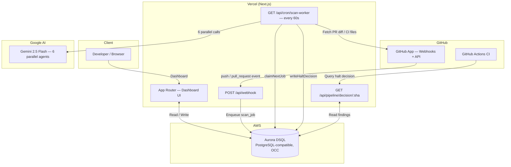

# Gatecheck

**An AI-powered security gate for GitHub pull requests and CI pipelines — built around a real Aurora DSQL concurrency problem.**

[](https://nextjs.org)
[](https://typescriptlang.org)
[](https://ai.google.dev)
[](https://aws.amazon.com/rds/aurora/dsql/)
[](https://vercel.com)
[](#license)

**Live Demo:** https://gatecheck-theta.vercel.app
**GitHub App:** https://github.com/apps/gate-check
**Main repo:** https://github.com/Akshat74747/Gatecheck

---

## Table of contents

- [The problem we actually had to solve](#the-problem-we-actually-had-to-solve)
- [Proof — concurrency handling in Aurora DSQL](#proof--concurrency-handling-in-aurora-dsql)
- [What Gatecheck does](#what-gatecheck-does)
- [System architecture](#system-architecture)
- [How Aurora DSQL is used](#how-aurora-dsql-is-used)
- [The deterministic rule engine](#the-deterministic-rule-engine)
- [The six-agent AI review pipeline](#the-six-agent-ai-review-pipeline)
- [Execution timeline](#execution-timeline)
- [Getting started](#getting-started)
- [Tech stack](#tech-stack)
- [Project structure](#project-structure)
- [Acknowledgment & license](#acknowledgment--license)

---

## The problem we actually had to solve

Aurora DSQL is a serverless, distributed, PostgreSQL-compatible database — but it doesn't support `SELECT ... FOR UPDATE` or `SKIP LOCKED`. There's no row-level locking. That's the tradeoff of strong consistency in a distributed system: instead of locks, DSQL uses **optimistic concurrency control (OCC)**. Two transactions can both proceed against the same row, and one of them will fail at commit time with a serialization error (Postgres/DSQL error code `40001`). The application is responsible for catching that and deciding what to do next.

We hit this constraint in two real places, not as a hypothetical:

1. **Job claiming.** A cron worker fires every 60 seconds in production and claims pending work from a `scan_jobs` table. With no `SKIP LOCKED` available, two overlapping invocations could try to grab the same row at once.
2. **Halt decisions.** A push webhook and a re-run scan can both try to write the safe/unsafe verdict for the *same commit* at the *same time*. The one that loses the race must never silently downgrade a `block` decision to an `allow` — that would be a real security regression caused by a database race, not a logic bug.

This is the part of the project we think is most worth a database-focused judge's attention, because it's the one piece that's genuinely hard to fake: you only write code that catches and retries on `40001` if you've actually had to.

## Proof — concurrency handling in Aurora DSQL

### Halt decisions: most-severe-wins, enforced in SQL

`writeHaltDecision` uses a single `INSERT ... ON CONFLICT` statement where every mutated column is guarded by a severity-rank comparison, so a losing write can't downgrade the stored verdict — it just doesn't take effect:

```ts
// lib/db/halt-decisions.ts
export async function writeHaltDecision(
  params: HaltDecisionParams,
  maxRetries = 3
): Promise<{ retries: number }> {
  const { repoId, commitSha, decision, severity, reason, findingIds, expiresAt } = params;
  const incomingRank = SEVERITY_RANK[severity] ?? 0;

  for (let attempt = 0; attempt <= maxRetries; attempt++) {
    try {
      await pool.query(
        `INSERT INTO halt_decisions
           (repo_id, commit_sha, decision, severity, reason, finding_ids, expires_at)
         VALUES ($1, $2, $3, $4, $5, $6, $7)
         ON CONFLICT (repo_id, commit_sha) DO UPDATE SET
           decision = CASE WHEN $8 > (
             CASE halt_decisions.severity
               WHEN 'critical' THEN 4 WHEN 'high' THEN 3
               WHEN 'medium'   THEN 2 WHEN 'low'  THEN 1 ELSE 0 END
           ) THEN EXCLUDED.decision ELSE halt_decisions.decision END,
           severity = CASE WHEN $8 > (/* same rank comparison */ 0)
             THEN EXCLUDED.severity ELSE halt_decisions.severity END,
           reason   = CASE WHEN $8 > (/* same rank comparison */ 0)
             THEN EXCLUDED.reason   ELSE halt_decisions.reason   END,
           finding_ids = (
             SELECT jsonb_agg(DISTINCT val)
             FROM jsonb_array_elements(halt_decisions.finding_ids || EXCLUDED.finding_ids) AS val
           ),
           updated_at = NOW()`,
        [repoId, commitSha, decision, severity, reason, JSON.stringify(findingIds), expiresAt, incomingRank]
      );
      return { retries: attempt };
    } catch (err: unknown) {
      const code = (err as { code?: string }).code;
      if (code === '40001' && attempt < maxRetries) {
        await new Promise(r => setTimeout(r, 50 * Math.pow(2, attempt)));
        continue; // retry on DSQL serialization conflict
      }
      throw err;
    }
  }
  throw new Error('writeHaltDecision: exhausted retries');
}
```

What this buys, concretely:

- **Most-severe-wins is enforced by the database, not application code.** A `medium` finding can never overwrite a stored `critical` halt — even if it arrives second, even on a retry, even under concurrent writers.
- **Evidence is merged, not discarded.** `jsonb_agg(DISTINCT ...)` over the union of old and new finding IDs means a losing write still contributes its findings instead of vanishing.
- **Retries are scoped to the real OCC error.** Only code `40001` triggers a retry, with exponential backoff (`50ms * 2^attempt`). Anything else fails fast and propagates.
- `writeHaltDecision` returns `{ retries }` specifically so the retry path is observable and testable — not just trusted to work.

### Job claiming: optimistic claim instead of row locks

`claimNextJob` can't use `FOR UPDATE` / `SKIP LOCKED` on DSQL, so it claims work in two steps — `SELECT` the oldest pending job, then `UPDATE` only if it's still pending:

```ts
// lib/db/scan-jobs.ts
export async function claimNextJob(): Promise<ScanJob | null> {
  // Stale jobs (stuck >5min from a function timeout) reset to pending.
  // Epoch arithmetic instead of INTERVAL — for DSQL compatibility.
  const staleThreshold = new Date(Date.now() - 5 * 60 * 1000).toISOString();
  await pool.query(
    `UPDATE scan_jobs SET status = 'pending', started_at = NULL
     WHERE status = 'processing' AND started_at < $1 AND attempts < max_attempts`,
    [staleThreshold]
  );

  const select = await pool.query<{ id: string }>(
    `SELECT id FROM scan_jobs
     WHERE status = 'pending' AND attempts < max_attempts
     ORDER BY created_at ASC LIMIT 1`
  );
  if (!select.rows[0]) return null;

  const result = await pool.query<ScanJob>(
    `UPDATE scan_jobs
     SET status = 'processing', started_at = NOW(), attempts = attempts + 1
     WHERE id = $1 AND status = 'pending'
     RETURNING *`,
    [select.rows[0].id]
  );
  return result.rows[0] ?? null;
}
```

The `WHERE id = $1 AND status = 'pending'` on the final update is the actual safety net: if a second invocation already claimed the row in the gap between the `SELECT` and this `UPDATE`, the row count comes back zero and this worker simply gets nothing back — instead of two workers processing the same job. The cron runs every 60 seconds in production. The system doesn't need this race to never happen; it needs a double-claim to be harmless if it does, and it is, because of the next point.

**The two proofs work together, not independently.** Job claiming can tolerate occasional double-execution specifically *because* halt-decision writes can absorb a duplicate scan without ever downgrading a previously-stored verdict. Neither piece of concurrency handling would be sufficient on its own — they're a matched pair, not two unrelated features.

Full schema, every table, and the complete request-by-request data flow are in [ARCHITECTURE.md](./ARCHITECTURE.md).

---

## What Gatecheck does

Gatecheck is a GitHub App that intercepts pull requests and pushes before a vulnerable change reaches production. It has two independent detection surfaces that share one database and one dashboard:

| Surface | Trigger | Engine | What it produces |
| --- | --- | --- | --- |
| **CI Security Gate** | Every push touching CI-relevant files | Deterministic rule engine — zero LLM | A halt/allow decision a CI step can query |
| **PR Review** | Every pull request open/update | Six Gemini 2.5 Flash agents in parallel | A synthesized verdict, confidence score, top 3 actions |

The deterministic gate is the part that can actually **stop a pipeline before checkout** — that's the mechanism, not a dashboard alert read after the fact. The AI review is a broader, more exploratory pass across code quality, not just security.

## System architecture



Aurora DSQL is the only stateful component — no Redis, no message broker, no separate worker process, no persistent server. The webhook handler, the cron worker, and the dashboard all read and write through the same connection pool and the same consistency boundary.

## How Aurora DSQL is used

| Purpose | Tables | Notes |
| --- | --- | --- |
| Job queue | `scan_jobs` | Webhook enqueues; cron worker claims — see Proof above |
| CI halt decisions | `halt_decisions` | Most-severe-wins under concurrent writers — see Proof above |
| Security findings | `findings` | Append-only, one row per detection, never updated |
| PR review lifecycle | `pull_requests`, `pr_reviews`, `agent_reports` | Full 6-agent review state, polled by the dashboard |
| Repository registry | `repos` | GitHub App installation metadata, enrollment state |
| Policy engine | `policies`, `rules` | Per-repo block/warn/off override per rule |

**Why DSQL instead of a traditional queue (Redis + BullMQ, SQS):** a separate broker means a separate managed service, separate credentials, and a cold-start penalty on every serverless invocation. DSQL is already the source of truth for every other table; keeping the queue there means one connection pool and one consistency boundary, with OCC's tradeoffs handled explicitly in code instead of papered over by a lock primitive that doesn't exist on this database.

**Other DSQL-specific adaptations in the schema and queries:**
- No foreign key constraints — referential integrity enforced at the application layer instead
- No `ON CONFLICT` unless backed by an inline `UNIQUE` constraint (async indexes can't be conflict targets)
- All indexes created `ASYNC`
- Stale-job detection uses epoch-timestamp comparison instead of `INTERVAL`, for DSQL compatibility

## The deterministic rule engine

Sixteen detectors, fanned out from a single registry (`lib/security/rules/index.ts`), every one of them pure and synchronous — no network calls, no LLM, no I/O. `runAllRules()` takes already-fetched files and returns findings; the database and network layers live entirely outside this module.

The headline detector — `pull_request_target` + fork-head checkout — walks the actual YAML AST rather than pattern-matching text, because workflow YAML supports arbitrary indentation, anchors, and flow-style mappings that regex reliably misses:

```ts
// lib/security/rules/workflow-yaml.ts (abridged)
function checkPullRequestTargetWithCheckout(doc, ctx, findings) {
  const onNode = getMapValue(doc.contents, "on");
  const usesPRT = /* true if pull_request_target appears in `on:` */;
  if (!usesPRT) return;

  for (const step of /* every actions/checkout step in every job */) {
    const ref = scalarString(getMapValue(step.with, "ref"));
    const looksLikePrHead = ref && /github\.event\.pull_request\.head/.test(ref);
    if (looksLikePrHead) {
      findings.push({
        ruleId: "workflow.pull-request-target-with-head-checkout",
        severity: "critical",
        message: `pull_request_target + checkout of PR head (\`${ref}\`) is the classic
                   supply-chain RCE pattern. The forked PR's code runs with secrets from your repo.`,
        suggestion: buildPullRequestTargetFix(ref), // two concrete remediation options, inline
      });
    }
  }
}
```

The other fifteen rules cover: hardcoded secrets (API keys, AWS keys, GitHub tokens, private key headers, JWTs), `permissions: write-all` and missing job-level scoping, untrusted PR title/body interpolated into shell `run:` blocks, privileged containers, self-hosted runners on public repos, unpinned third-party actions and `actions/checkout` (tag instead of 40-char SHA), Dockerfile root-user final stages and `ADD <url>` without integrity checks, lockfile-only edits with no matching manifest change (the hash-substitution signature), and outbound calls to non-allowlisted domains inside CI shell blocks.

Each finding carries a concrete, embedded fix — not a generic example. The `pull_request_target` fix, for instance, shows the user's *actual* offending `ref:` line and two real remediation paths (switch to `pull_request`, or keep the privileged trigger but drop the head checkout), because a fix the user has to translate from a template is a fix many people skip.

## The six-agent AI review pipeline

On every PR, six Gemini 2.5 Flash agents run in parallel — Security, Bugs, Performance, Readability, Best Practices, Documentation — each scoped to its own slice of the diff. A synthesizer agent combines all six reports into a single verdict (`approve` / `request_changes` / `comment`) with a confidence score and the top three concrete actions. If the synthesizer doesn't respond within 25 seconds, a code-computed fallback verdict — built directly from finding severity counts, no LLM call — takes over, so a review always completes even if the model call doesn't.

> Note on verification: the rule engine and the DSQL concurrency layer above are confirmed directly from source. The agent orchestration and synthesizer fallback are documented in `ARCHITECTURE.md` and reflected in the live dashboard's behavior; if you want this section backed by the same line-by-line proof as the sections above, `lib/agents/synthesizer.ts` and `lib/review/runner.ts` are the files to check next.

## Execution timeline

The project shipped in a single push, in this order, because each step had to be provable before the next one was worth building:

1. Provisioned Aurora DSQL and the six-table schema (`repos`, `scan_jobs`, `findings`, `halt_decisions`, `policies`, plus PR review tables).
2. Built and proved the deterministic rule engine against a real test repository (`Gatecheck-test`) — starting with the `pull_request_target` detector, since it's the highest-value, hardest-to-get-wrong rule.
3. Wired the webhook receiver and the cron worker, then hit the DSQL row-locking limitation directly while building job claiming — which is what produced the optimistic-claim design above.
4. Built the halt-decision writer, hit the same OCC tradeoff from the other direction, and added the retry-on-`40001` logic.
5. Published the runtime GitHub Action (the actual halt step) and ran it end-to-end against a live PR.
6. Added the six-agent Gemini review pipeline, the Repo Health score, and the analytics dashboard.

## Getting started

1. Install the [GitHub App](https://github.com/apps/gate-check) — webhooks configure automatically, no YAML to write.
2. Enroll a repository from the **Repositories** page in the dashboard.
3. Trigger a scan — push a commit touching `.github/workflows/`, a `Dockerfile`, or a dependency manifest, or open a PR.
4. Add the runtime gate (optional, recommended) as the *first* step of any job you want gated:

```yaml
- name: Gatecheck security gate
  run: |
    DECISION=$(curl -sf \
      "https://gatecheck-theta.vercel.app/api/pipeline/decision/${{ github.sha }}" \
      -H "Authorization: Bearer ${{ secrets.GATECHECK_TOKEN }}" \
      | jq -r '.decision')
    if [ "$DECISION" = "halt" ]; then
      echo "Gatecheck: blocking findings exist for this commit"
      exit 1
    fi
```

The gate soft-fails on Gatecheck API outages — a Gatecheck outage never breaks your CI.

## Tech stack

| Layer | Technology |
| --- | --- |
| Framework | Next.js 16 App Router (TypeScript) |
| Hosting | Vercel (serverless functions + cron) |
| Database | AWS Aurora DSQL (serverless, PostgreSQL-compatible, OCC) |
| AI | Google Gemini 2.5 Flash via `@google/generative-ai` |
| GitHub integration | GitHub App (RS256 JWT → installation token) |
| Charts | Recharts |
| Styling | Tailwind CSS 4 |

## Project structure

```
gatecheck/
├── app/
│   ├── api/
│   │   ├── webhook/route.ts             # GitHub App webhook handler
│   │   ├── cron/scan-worker/route.ts    # Cron worker — claims and runs jobs
│   │   ├── pipeline/decision/route.ts   # CI halt decision query
│   │   ├── prs/[id]/route.ts            # PR detail + live review status
│   │   ├── repo-health/[repoId]/        # Health score + commit diff
│   │   ├── repos/route.ts               # Repository list + enrollment
│   │   ├── findings/route.ts            # Security findings query
│   │   ├── analytics/route.ts           # Aggregated charts data
│   │   └── settings/route.ts            # App configuration
│   └── ...                              # Dashboard pages (repos, PRs, analytics, health, settings)
├── lib/
│   ├── agents/                          # 6 specialist agents + synthesizer
│   ├── db/
│   │   ├── scan-jobs.ts                 # claimNextJob — optimistic job claim
│   │   ├── halt-decisions.ts            # writeHaltDecision — most-severe-wins
│   │   ├── findings.ts / repos.ts / policies.ts
│   ├── github/                          # App auth + API helpers
│   ├── review/runner.ts                 # Orchestrates the 6-agent pipeline
│   ├── scanner/index.ts                 # Deterministic push scan engine
│   ├── security/rules/                  # 16 deterministic detectors
│   └── llm/gemini.ts                    # Gemini client with retry + fallback
└── __tests__/
```

Full component map, sequence diagrams, and the complete schema: [ARCHITECTURE.md](./ARCHITECTURE.md).

## Acknowledgment & license

Dashboard layout, repo health scoring, and signal-card UX are inspired by [LGTM](https://lgtm.com) (Looks Good To Me) — the code analysis platform built by Semmle, later acquired by GitHub and succeeded by GitHub Advanced Security.

MIT licensed.
